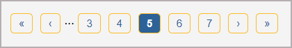

# react-pagination-accessible

This package was created with the purpose of simplifying the implementation of an accessible and customizable react pagination.



## Getting Started

Install this package:

```shell
npm react-pagination-accessible@1.0.2
```

Import the Pagination component:

```js
import Pagination from "react-pagination-accessible";
```

You can integrate this component as a simple React component.

## Usage

```js
    return (
        <Pagination 
            currentPage={currentPage}
            setCurrentPage={setCurrentPage}
            itemsPerPage={itemsPerPage}
            totalItems={data.length}
        />
    );
```

## Expected parameters

The parameters are states to be defined in the component where Pagination will be called.     
* currentPage is the index where pagination will initially appear. 
* setCurrentPage is the setter for the currentPage state.
* itemsPerPage is the number of items to display per page.
* totalItems represents the total number of items to distribute across the different pages.

```js
    const [currentPage, setCurrentPage] = useState(1);
    const [itemsPerPage, setItemsPerPage] = useState(10)
    const [data, setData] = useState([
        { name:'data0'},
        { name:'data1'},
        { name:'data2'},
        { name:'data3'},
        { name:'data4'},
        //............
    ])

    return (
        <Pagination 
            currentPage={currentPage}
            setCurrentPage={setCurrentPage}
            itemsPerPage={itemsPerPage}
            totalItems={data.length}
        />
    );
```

To calculate the different elements to display, add these 3 lines (adapt the variable names used if necessary)

```js
    const startIndex = (currentPage - 1) * itemsPerPage;
    const endIndex = startIndex + itemsPerPage;
    const currentData = data?.slice(startIndex, endIndex);
```

## Usage with parameters

```js
const Component = () => {
    const [currentPage, setCurrentPage] = useState(1);
    const [itemsPerPage, setItemsPerPage] = useState(10)
    const [data, setData] = useState([
        { name:'data0'},
        { name:'data1'},
        { name:'data2'},
        { name:'data3'},
        { name:'data4'},
        //............
    ])

    const startIndex = (currentPage - 1) * itemsPerPage;
    const endIndex = startIndex + itemsPerPage;
    const currentData = data?.slice(startIndex, endIndex);

    return (
        {currentData.map((data) => (
            <p>{data.name}</p>
        ))}
        <Pagination 
            currentPage={currentPage}
            setCurrentPage={setCurrentPage}
            itemsPerPage={itemsPerPage}
            totalItems={data.length}
        />
    );
}

export default Component;
```

## Customize your breadcrumb

Here is a basic customization example. You can adjust the styles to match your branding guidelines.  

```css
.pagination {
    display: flex;
    justify-content: center;
    padding: 1rem 0;
    bottom: 0;
    left: 50%;
    right: 50%;
}
  
.pagination button {
    margin: 0 3px;
    border-radius: 5px;
    cursor: pointer;
    background: #ffffff;
    padding: 2px 5.25px;
    border: 1px solid #6e6c6e;
    color: #000000;
}
  
.pagination button.current-page {
    background: #000000;
    color: #ffffff;
    font-weight: bold;
}

```